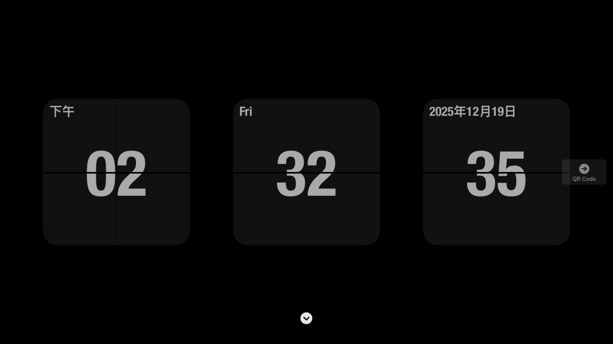
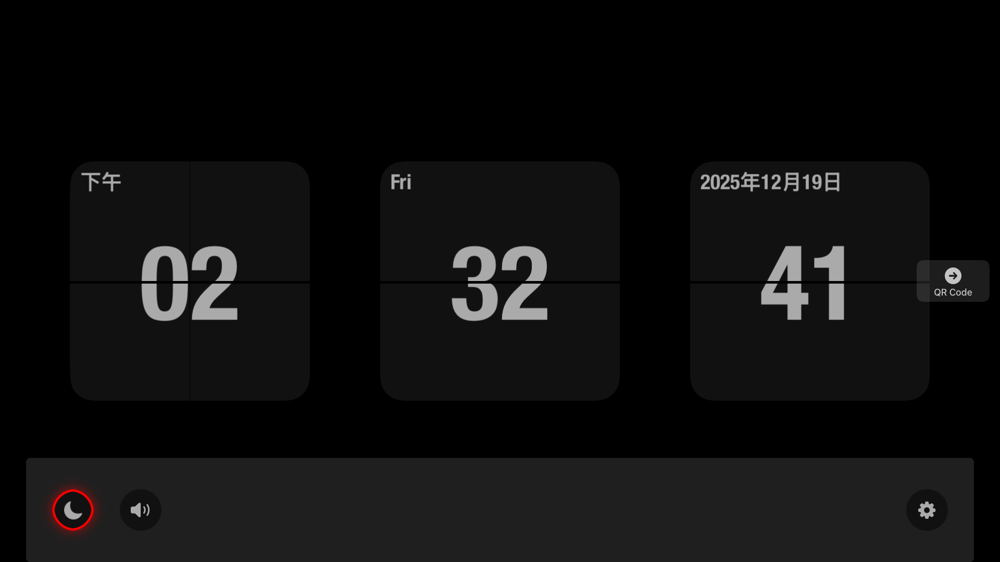
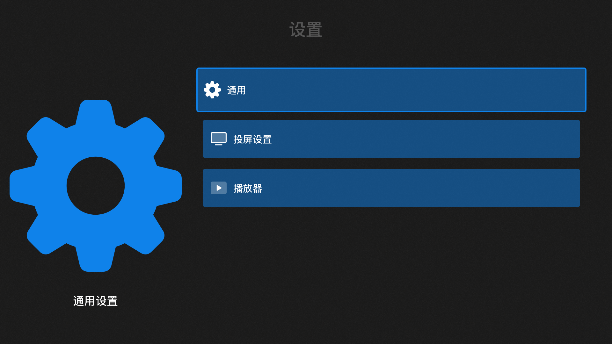
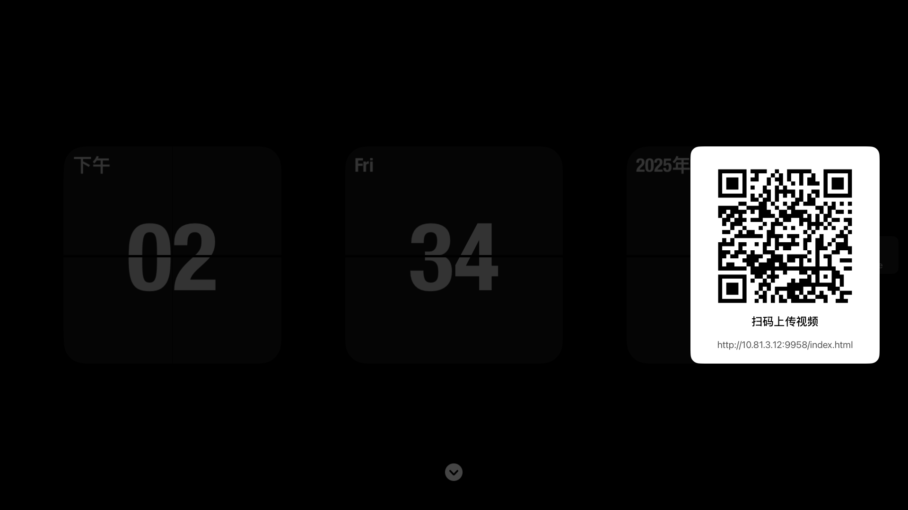

# 糖葫芦投屏

  

TVOS上使用的DLNA投屏、Http投屏工具 
TF地址 
- [https://testflight.apple.com/join/7ta4Jx6F](https://testflight.apple.com/join/7ta4Jx6F)
# 首页
默认打开显示时钟页面

  

点击遥控器器上的downArrow按钮，会显示底部菜单

  

# 设置
app的相关设置会显示在这里

  

# DLNA投屏
以优酷站为例,点击播放页面的投屏按钮后，投屏设备选项后添加上【糖葫芦】的选项

  

# Http投屏
点击遥控器的右键，弹出二维码，手机与tv在同一个局域网下，扫码二维码显示二维码页面

  

  

### releases

- [releases.md](https://github.com/never88gone/HSBTVBrowser/blob/main/releases.md?plain=1)

### Telegram Group
-  [https://t.me/tanghulutvos](https://t.me/tanghulutvos)

 

  

### Links

- [debugly/fsplayer](https://github.com/debugly/fsplayer)
- [ikishorek/TVVLCKit](https://github.com/ikishorek/TVVLCKit)
- [SnapKit/Masonry](https://github.com/SnapKit/Masonry)
- [jsonmodel/jsonmodel](https://github.com/jsonmodel/jsonmodel)
- [CocoaLumberjack/CocoaLumberjack](https://github.com/CocoaLumberjack/CocoaLumberjack)
- [SDWebImage/SDWebImage](https://github.com/SDWebImage/SDWebImage)
-  [lechium/KBBulletinView](https://github.com/lechium/KBBulletinView)
-  [zattoo/TvOSSlider](https://github.com/zattoo/TvOSSlider)
-  [vtourraine/VTAcknowledgementsViewController](https://github.com/vtourraine/VTAcknowledgementsViewController)
-  [AliSoftware/Reusable](https://github.com/AliSoftware/Reusable)
-  [nicklockwood/GZIP](https://github.com/nicklockwood/GZIP)
-  [AliSoftware/Reusable](https://github.com/AliSoftware/Reusable)
-  [robbiehanson/CocoaAsyncSocket](https://github.com/robbiehanson/CocoaAsyncSocket)
-  [SwiftyJSON/SwiftyJSON](https://github.com/SwiftyJSON/SwiftyJSON)
-  [yichengchen/swifter](https://github.com/yichengchen/swifter)
-  [mattt/Ono](https://github.com/mattt/Ono)
-  [yichengchen/ATV-Bilibili-demo](https://github.com/yichengchen/ATV-Bilibili-demo)
-  [steventroughtonsmith/tvOSBrowser](https://github.com/steventroughtonsmith/tvOSBrowser)
